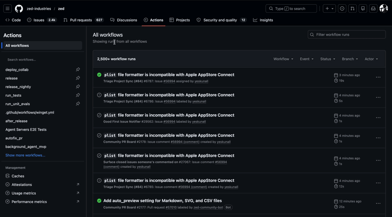

# Actions Workflow Search

A browser extension that adds a search box to the GitHub Actions sidebar, so you can quickly find workflows without scrolling through a long list.

## Demo



## Features

- Search by workflow name or filename
- Automatically loads all workflows when you start searching
- Works with GitHub's Turbo navigation (no page reload needed)
- Supports Chrome, Edge, Firefox, and all Chromium-based browsers

## Installation

### Chrome / Edge / Brave
Load the `output/chrome-mv3/` folder as an unpacked extension from `chrome://extensions`.

### Firefox
Load the `output/firefox-mv2/` folder as a temporary extension from `about:debugging`.

## Development

```sh
npm install

# Dev mode
npm run dev            # Chrome
npm run dev:firefox    # Firefox

# Build
npm run build:all      # All browsers

# Zip for distribution
npm run zip:all
```

## License

MIT
